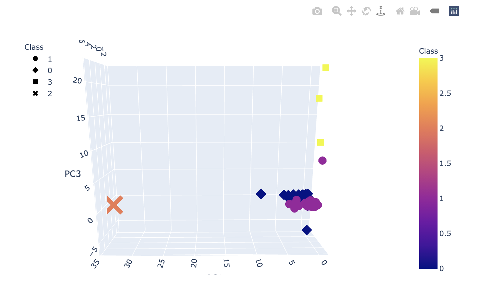

# Cryptocurrencies
The purpose of this module was to understand the concept and practice of unsupervised machine learning models. These models are useful and practical when we're not necessarily sure what desired outcomes would be, unlike a supervised machine learning model where we have a good sense of what to expect or the behaviors to drive.

For this  analysis, we planned to follow the PCA test to analyze and visualize top traded crypto currencies. We needed to follow best practices around preprocessing data (e.g., removing nulls, cleaning column names, etc.), reduce data dimensions, and then deploy clustering through k-Means. K-Means in particula is helpful in this type of analysis as it helps identify potential patterns within the data, that we would not know otherwise. This information could then feed additional ML models based on these findings. Based on this specific K-Means, we identified 4 clusters of crypto currencies. From there, we used pandas to visualize both 3D and 2D plots to identify the clusters. Images Below:

## 3-D Image

## 2D Image

## KMeans Elbow Curve

